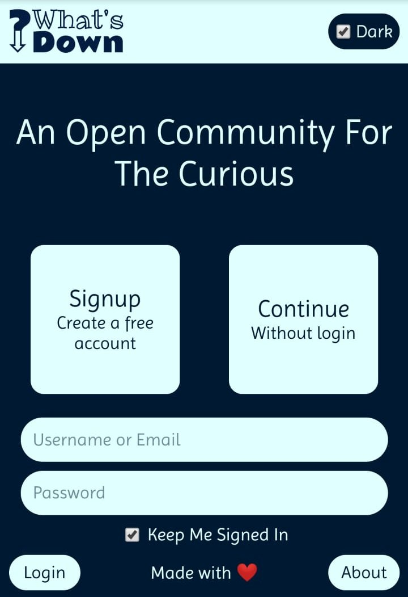
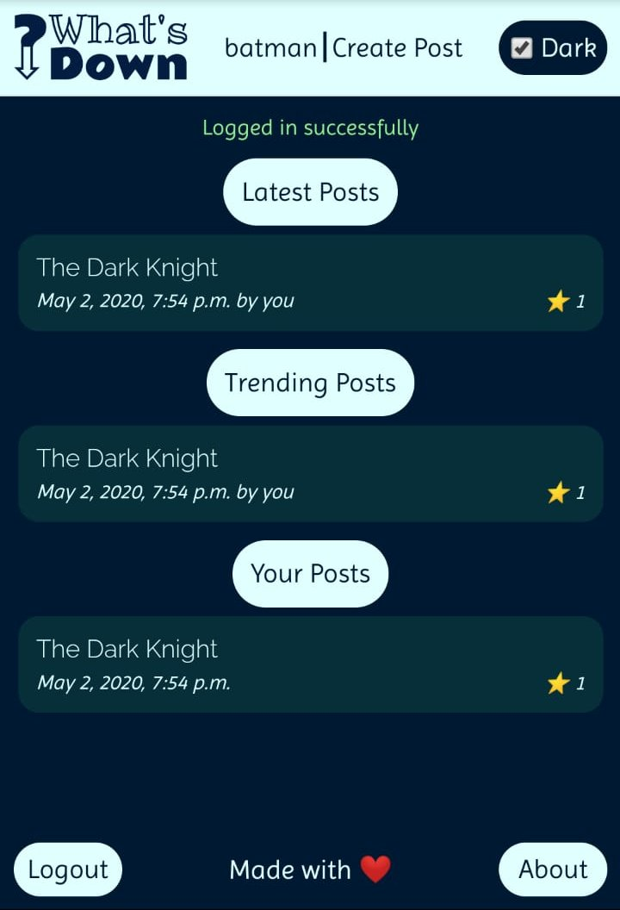
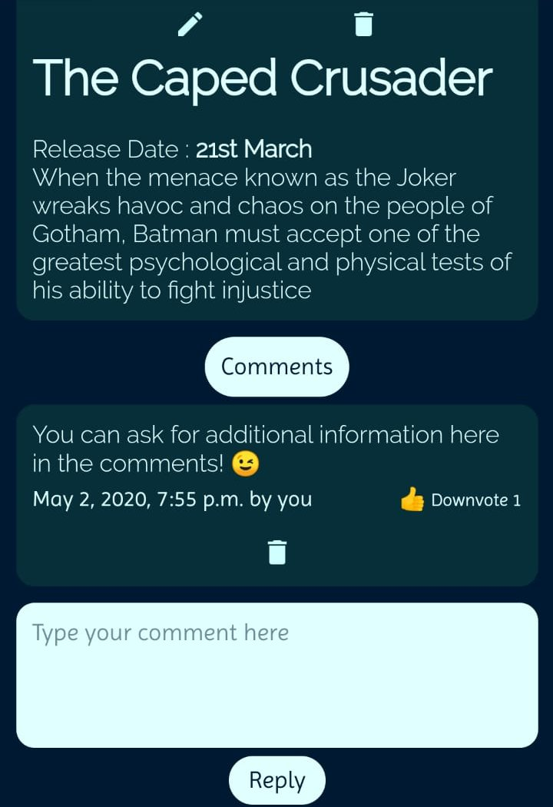
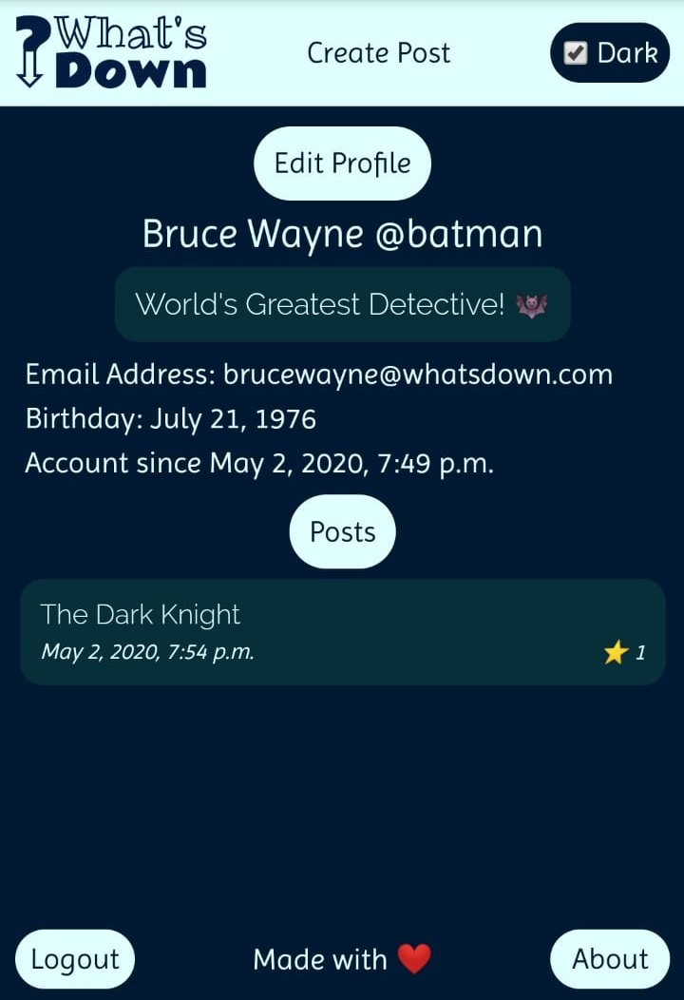

# whats_down
An online publishing platform based on the 'Django' framework.

# Features:
* Allows users to create and star/unstar posts as wells as make and upvote/downvote comments to posts.
* See the latest and trending posts by users.
* Light and dark themes supported.
* Our editor also supports the [Markdown](https://daringfireball.net/projects/markdown/) syntax.

# Prerequisites:
* [Django](https://www.djangoproject.com/) - a web developement framework for [Python](https://www.python.org/)
* [Markdown library for Python](https://pypi.org/project/Markdown/) - for markdown support

# Preview:
   
